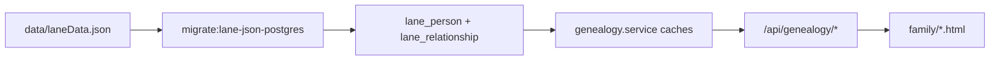

# Lane Family Tree Data Schema

Lane genealogy is a **directed graph**: people are **nodes**, relationships are **edges**. The canonical document is `data/laneData.json`. PostgreSQL mirrors that graph for queries; see [LANE_POSTGRES_GRAPH.md](./LANE_POSTGRES_GRAPH.md) for table DDL and migration.

---

## Canonical document: `data/laneData.json`

```json
{
  "nodes": [ /* people */ ],
  "links": [ /* relationships */ ]
}
```

| Path | Role |
|------|------|
| `services/genealogy.service.js` | Runtime cache + API helpers (parents, children, spouses, search) |
| `services/lane-postgres.service.js` | Import graph into Postgres; ancestor/descendant CTEs |
| `services/genealogy-import.service.js` | OCR/import → `emitLaneDataJson`, `validateLaneData` |
| `controllers/genealogy.controller.js` | `/api/genealogy/*` |
| `public/family/genealogy.html` | Interactive tree viewer |

---

## Person schema (`nodes[]`)

Each person is keyed by integer **`id`** (stable primary key in APIs, Postgres `person_id`, and UI deep links).

### Core fields

| Field | Type | Notes |
|-------|------|--------|
| `id` | number | Unique person id |
| `name` | string | Display name |
| `generation` | number | Tree generation (0 = earliest in the published line, etc.) |
| `gender` | string | `"M"`, `"F"`, or `"U"` |
| `lastName` | string | Often a label (e.g. spouse-of line), not always a surname |
| `birthYear` | number \| string | Year or empty |
| `deathYear` | number \| string | Year or text (e.g. `"aft. May 1676"`) |
| `birthDate` | string | ISO date when set |
| `deathDate` | string | ISO date when set |
| `born` | string | Birth / origin place |
| `deathPlace` | string | Death place |
| `burial` | string | Burial place |
| `text` | string | Research notes, evidence, citations |

### Optional enrichment

Stored on the node object and preserved in Postgres `lane_person.payload` (JSONB). Not all fields are indexed columns.

| Field | Shape | Notes |
|-------|--------|--------|
| `occupation` | array | Entries like `{ "job": "tanner" }`, `{ "government": "selectman" }`, or `{ "text": "...", "service": [{ "war", "text" }] }` |
| (various) | — | OCR hints, military prose, museum links, etc. added over time |

Import defaults for new nodes from OCR: see `emitLaneDataJson()` in `services/genealogy-import.service.js`.

---

## Relationship schema (`links[]`)

Directed edges between person ids.

| Field | Type | Notes |
|-------|------|--------|
| `source` | number | Subject person id |
| `target` | number | Related person id |
| `relation` | string | `father` \| `mother` \| `spouse` \| `associated` |
| `color` | string | UI hint: `#39F` father, `#F39` mother, `#CC0` spouse, `#999` associated |

### Edge direction

| `relation` | Meaning | Direction |
|------------|---------|-----------|
| `father` | Parent link | `source` = **child**, `target` = **father** |
| `mother` | Parent link | `source` = **child**, `target` = **mother** |
| `spouse` | Marriage / partnership | Either direction between the two ids (deduped on import) |
| `associated` | Non-parental association | Context-dependent; used sparingly |

Example:

```json
{ "source": 6, "target": 4, "relation": "father", "color": "#39F" }
```

Person **6**’s father is person **4**.

Validation: `validateLaneData()` in `services/genealogy-import.service.js` rejects duplicate node ids, dangling link endpoints, and unsupported `relation` values.

---

## PostgreSQL mapping

Graph tables are created in `services/database.service.js` (`createTables()`).

### `lane_person`

| Column | Source |
|--------|--------|
| `person_id` | `nodes[].id` |
| `name`, `generation`, `gender` | Indexed extracts |
| `birth_year` | Parsed from `birthYear` when numeric |
| `death_year_text` | String form of `deathYear` |
| `born`, `death_place` | Place strings |
| `payload` | Full node JSON |

### `lane_relationship`

| Column | Source |
|--------|--------|
| `source_person_id` | `links[].source` |
| `target_person_id` | `links[].target` |
| `relation` | `links[].relation` |
| `payload` | Full link JSON (includes `color`) |

Unique constraint: `(source_person_id, target_person_id, relation)`.

Rebuild from JSON:

```bash
npm run migrate:lane-json-postgres
```

---

## Supplementary datasets (`lane_dataset`)

All `data/lane*.json` files (except `*backup*` and `*.schema.json`) are stored in `lane_dataset` by filename stem (`dataset_key`). They **do not** replace `nodes` / `links`; they reference people or support other Lane tools.

Examples:

| `dataset_key` | Purpose |
|---------------|---------|
| `laneData` | **Tree graph** (`nodes` + `links`) |
| `lane-pdf-person-portraits` | Book plate portraits → `personId` |
| `lane-pdf-image-manifest` | Plate gallery manifest |
| `lane-museum-content` | Museum exhibits |
| `lane-trading-cards-first-edition` | Trading cards (`person` \| `artifact` \| `event`) |
| `lane-war-battles`, `lane-historians`, … | Thematic content |

### Other Postgres (not graph shape)

| Table | Purpose |
|-------|---------|
| `lane_pdf_gallery_hidden_plate` | Per-client hidden plates |
| `lane_pdf_gallery_hide_stack` | Undo stack for hides |
| `lane_pdf_gallery_filter_preset` | Saved gallery filter views |
| `genealogy_forward_geocode_cache` | Cached lat/lng for place strings |

---

## Runtime flow



1. Startup: `createTables()` → Lane JSON backfill → `refreshGenealogyCachesFromPostgres()`.
2. `genealogy.service.js` reads hydrated caches first; falls back to file JSON if Postgres is empty.
3. API shapes in `controllers/genealogy.controller.js` are unchanged from the pre-Postgres era.

---

## UI entry points

| Page | Role |
|------|------|
| `/family/lane-family.html` | Lane hub |
| `/family/genealogy.html` | Interactive tree (`?personId=` deep links) |
| `/family/genealogy-import.html` | OCR / strict import pipeline |
| `/family/lane-memorial-wall.html` | Memorial wall |
| `/family/lane-pdf-gallery.html` | Book plates gallery |

---

## Related docs

- [LANE_POSTGRES_GRAPH.md](./LANE_POSTGRES_GRAPH.md) — Postgres tables, migration, runtime cutover
- [FRONTEND_PATTERNS.md](./FRONTEND_PATTERNS.md) — Lane maps, geocode, gallery patterns
- `AGENTS.md` — Lane PDF gallery assets and npm scripts
