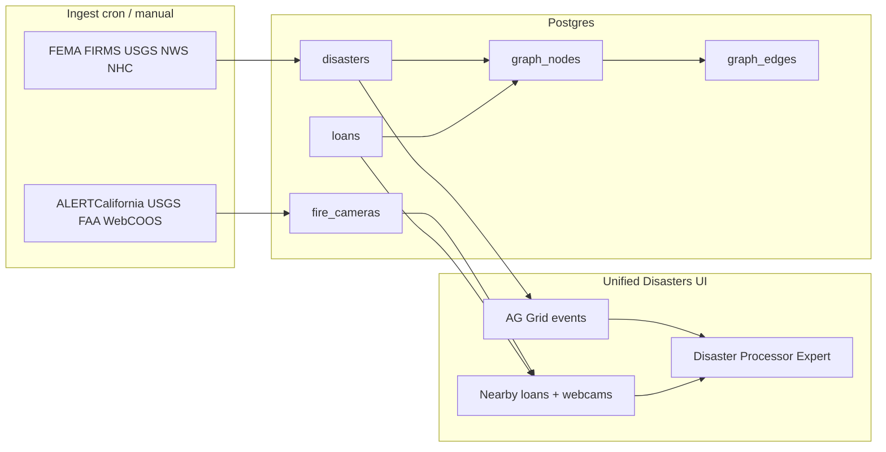
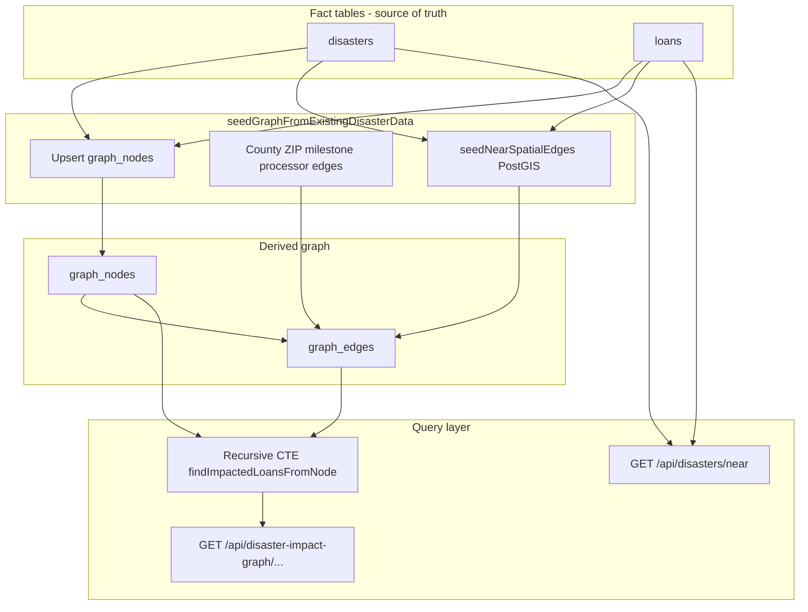

# Unified Disasters — database schema reference

The **Unified Disasters** UI (`public/finance/disasters-unified.html`) does not use a separate schema. It reads the same Postgres tables as the pipeline risk dashboard and webcam catalog. Schema is created idempotently at runtime (not from a single migration folder).

**Source of truth for DDL:**

- `services/disasters.service.js` — `disasters`, `fire_cameras`
- `services/database.service.js` — `loans`, PostGIS `geom` columns
- `services/disaster-impact-graph.service.js` — `graph_nodes`, `graph_edges`

**Related docs:** `docs/DISASTER_RISK.md`, `docs/DATABASE_SCHEMA_OVERVIEW.md` (loans, disasters, PostGIS)

---

## How the pages use the database



| Page | Primary tables |
|------|----------------|
| `public/finance/disasters-unified.html` | `disasters` (grid), `loans` + `fire_cameras` (selection / `GET /api/disasters/near`) |
| `public/finance/disasters-webcams.html` | `fire_cameras` only |
| `public/finance/pipeline-risk-dashboard.html` | `loans` (+ disaster overlap via `fema_data` / risk fields) |
| `public/disaster-impact-graph.html` | `graph_nodes`, `graph_edges` (derived from `disasters` + `loans`) |

**AI chat** on Unified Disasters uses LangChain memory in shared `conversations` / `messages` tables (`services/database.service.js`), keyed by `sessionId` such as `unified-disaster-processor` — not disaster-specific tables.

---

## Graph approach (highlighted)

The platform uses **two complementary models** for linking disasters to loans. Unified Disasters leans on the **spatial** model; the **impact graph** adds a persisted, multi-hop relationship layer for exploration and “who is impacted?” queries.

| Model | Storage | How links are built | Best for |
|-------|---------|---------------------|----------|
| **Spatial / near** | `disasters`, `loans`, `fire_cameras` + optional `geom` | Live `ST_DWithin` or Haversine at query time (`GET /api/disasters/near`) | Map pickers, nearby lists, KML export, AI context on current selection |
| **Impact graph** | `graph_nodes`, `graph_edges` | Batch **reseed** from disasters + loans + PostGIS join | County/disaster → loan paths, processor/milestone context, prototype graph UI |

**pgRouting is not used** (not on Render’s extension allowlist). Traversal is **recursive SQL** over `graph_edges`, not a routing engine.

### Architecture



### Node types (`graph_nodes.node_type`)

| Type | `external_id` | Role |
|------|---------------|------|
| `disaster_event` | disaster `source_id` (or row `id`) | One node per ingested event in the 90-day window |
| `county` | county FIPS | Geographic hub |
| `zip` | ZIP code | Links loans in a postal area |
| `loan` | `loan_number` | Pipeline loan |
| `milestone` | normalized milestone slug | Loan workflow stage |
| `processor` | normalized processor slug | Ops assignment (from `fema_data` fallback today) |
| `fema_declaration`, `nws_alert`, `nasa_fire`, `state`, `borrower` | reserved in CHECK | Valid types; fuller source-specific seeding is TODO |

### Edge types (`graph_edges.edge_type`) — how the graph is wired

| Edge | Typical direction | Meaning | Confidence / source |
|------|-------------------|---------|---------------------|
| `HAS_DECLARATION` | county → disaster_event | County has this declaration/event | `disasters-seed`, ~0.9 |
| `AFFECTS` | disaster_event → zip, or county → disaster | Disaster affects ZIP/county area | county/zip heuristics, ~0.7–0.85 |
| `CONTAINS` | county → zip → loan | Geography contains loan | `loan-seed`, ~0.92–0.95 |
| `NEAR` | disaster_event → loan | **PostGIS** `ST_DWithin` (~50 mi default); distance in `metadata_json` | `postgis-spatial`; confidence scales with distance |
| `CURRENTLY_IN` | loan → milestone | Loan’s pipeline milestone | `loan-seed`, ~0.97 |
| `ASSIGNED_TO` | milestone → processor | Milestone tied to processor label | `loan-seed`, ~0.75 |
| `LOCATED_IN`, `HAS_ALERT`, `HAS_RISK`, `REQUIRES_REVIEW` | reserved | In schema; limited seed usage today |

**Prototype chain** (as labeled in `public/disaster-impact-graph.html`):

`county → disaster → zip → loan → milestone → processor`

Plus **direct** `disaster_event --NEAR--> loan` when coordinates exist (strongest spatial signal).

### Seeding pipeline (`seedGraphFromExistingDisasterData` in `services/disaster-impact-graph.service.js`)

1. **Idempotent skip** — If nodes and edges already exist and `force` is not set, return `skipped: true`.
2. **Load facts** — Up to 400 recent `disasters` (90-day window, exclude `event_type = 'camera'`) and 400 `loans`.
3. **Upsert nodes** — Counties, disaster events, zips, loans, milestones, processors.
4. **Semantic edges** — `HAS_DECLARATION`, `CONTAINS`, `AFFECTS` (county/disaster/zip), `CURRENTLY_IN`, `ASSIGNED_TO`.
5. **Spatial edges** — `seedNearSpatialEdges()` joins `disasters.geom` ↔ `loans.geom` with `ST_DWithin` (50 mi), writes `NEAR` with `distance_meters` in metadata.
6. **Full refresh** — `refreshDisasterImpactGraphFromCurrentData()` truncates edges/nodes and reseeds (destructive rebuild).

**TODOs in code** (not yet automated after daily disaster refresh): reconcile reseed with `refresh-disasters.js`, richer FEMA/FIRMS/NWS node types, production Encompass processor assignment.

### Traversal — finding impacted loans

`findImpactedLoansFromNode` in `services/disaster-impact-graph.service.js` runs a **PostgreSQL recursive CTE** (`walk`):

- Starts at a node (disaster, county, or arbitrary `nodeId`).
- Walks **undirected** edges up to depth 3–6 (configurable).
- Collects all reachable **`loan`** nodes, ordered by hop depth.
- **`attachLoanDetails`** hydrates rows from the `loans` table.

**APIs** (`routes/disaster-impact-graph.routes.js`):

| Method | Path | Use |
|--------|------|-----|
| GET | `/api/disaster-impact-graph/disaster/:disasterId/loans` | Loans reachable from a disaster node |
| GET | `/api/disaster-impact-graph/county/:countyFips/loans` | Loans reachable from a county node |
| GET | `/api/disaster-impact-graph/:nodeId` | Subgraph around a node |
| GET | `/api/disaster-impact-graph/:nodeId/summary` | Impact summary |

### Graph vs Unified Disasters UI

| Concern | Unified Disasters | Impact graph |
|---------|-------------------|--------------|
| Data freshness | Reads `disasters` / `fire_cameras` / `loans` directly | Graph is **stale until reseed** |
| Loan discovery | Radius from selected lat/lng (`/near`) | Multi-hop paths (county, zip, NEAR, milestone) |
| Webcams | `fire_cameras` via `/near` | Not modeled as graph nodes today |
| Processor ops context | AI + grid selection | Explicit `loan → milestone → processor` edges |

**Recommendation:** Treat **`disasters` + `loans` + PostGIS** as operational truth for maps and AI; use the **graph** for relationship analytics, county-wide impact prototypes, and explaining *why* a loan might be tied to an event (not only *how far* it is).

---

## 1. `disasters` — rolling multi-source events

**Purpose:** One row per disaster event from external feeds (FEMA, NASA FIRMS, USGS, NWS, NHC). Powers the Unified Disasters AG Grid and map markers.

**DDL** (`services/disasters.service.js`):

| Column | Type | Notes |
|--------|------|--------|
| `id` | SERIAL PK | Internal row id |
| `source` | TEXT NOT NULL | e.g. `fema`, `firms`, `usgs`, `nws`, `nhc` |
| `event_type` | TEXT NOT NULL | wildfire, earthquake, hurricane, flood, etc. |
| `county_fips` | CHAR(5) NOT NULL | US county FIPS (join key) |
| `county_name` | TEXT | Display / filter |
| `state_abbr` | VARCHAR(3) | US state or CA province (`services/disasters-migration-state-abbr.sql`) |
| `start_time` | TIMESTAMPTZ NOT NULL | Event start |
| `end_time` | TIMESTAMPTZ | Optional end |
| `severity` | TEXT | Source-specific severity |
| `title` | TEXT | Human-readable label |
| `lat`, `lng` | DOUBLE PRECISION | Geocoded county centroid (when available) |
| `source_id` | TEXT | Provider’s id for dedup |
| `raw` | JSONB | Full upstream payload |
| `created_at` | TIMESTAMPTZ | Insert time |

**Constraints / indexes:**

- **Unique:** `(county_fips, source, source_id, start_time)` — `disasters_uniq`
- **Indexes:** `idx_disasters_start_time`, `idx_disasters_state`, `idx_disasters_fips`
- **Optional PostGIS:** generated `geom geography(Point,4326)` + GiST `idx_disasters_geom` when extension loads

**Lifecycle:** `DISASTER_ROLLING_WINDOW_DAYS = 90` in `services/disasters.service.js` — ingest, UI filters, and prune keep ~90 days of events in sync.

**Refresh:** `npm run refresh-disasters` → `POST /api/disasters/refresh`

---

## 2. `fire_cameras` — fixed hazard webcam mounts

**Purpose:** Stable camera locations (not time-series disaster events). Used by webcam catalog, Unified Disasters “nearby cameras,” and KML export.

**DDL** (`services/disasters.service.js`):

| Column | Type | Notes |
|--------|------|--------|
| `id` | SERIAL PK | |
| `source` | TEXT NOT NULL | `alertcalifornia`, `usgs_nims`, `usgs_volcano`, `faa_weathercam`, `webcoos`, `ucsd_hpwren`, `ucsd_pier` |
| `source_id` | TEXT NOT NULL | Provider camera id |
| `name` | TEXT | Display name |
| `lat`, `lng` | DOUBLE PRECISION NOT NULL | Mount coordinates |
| `county_name`, `county_fips` | TEXT / CHAR(5) | From reverse geocode at ingest |
| `state_abbr` | VARCHAR(3) | Default `CA` in legacy rows |
| `camera_url`, `network_url`, `image_url` | TEXT | Feed / snapshot URLs |
| `status` | TEXT | Provider status |
| `hazard_types` | JSONB | e.g. `["fire"]`, `["flood","river"]` — filtered via GIN |
| `media_type` | TEXT | `live_stream`, `still_image`, etc. |
| `refresh_minutes` | INT | Snapshot refresh hint |
| `last_image_at` | TIMESTAMPTZ | Last known image time |
| `raw` | JSONB | Provider payload |
| `geocoded_at` | TIMESTAMPTZ | When county was reverse-geocoded |
| `created_at`, `updated_at` | TIMESTAMPTZ | |

**Constraints / indexes:**

- **Unique:** `(source, source_id)`
- **Indexes:** state, county, source, `(source, state_abbr)`, GIN on `hazard_types`
- **Optional PostGIS:** `geom` + `idx_fire_cameras_geom`

**Refresh:** `npm run refresh:hazard-webcams` → `POST /api/disasters/refresh-cameras` (separate from daily disaster refresh; can upsert 1000+ rows).

**API:** `GET /api/disasters/cameras`, `GET /api/disasters/cameras/:id/snapshot`

---

## 3. `loans` — pipeline properties for risk and proximity

**Purpose:** Encompass-style pipeline loans with geocoded property location and disaster/flood risk fields. Unified Disasters shows **nearby loans** when a disaster is selected (`GET /api/disasters/near` with `types=loans`).

**DDL** (`services/database.service.js`):

| Column | Type | Notes |
|--------|------|--------|
| `id` | SERIAL PK | |
| `loan_number` | VARCHAR(50) UNIQUE | Business key |
| `borrower_name` | VARCHAR(255) | |
| `property_address`, `city`, `state`, `county`, `zip_code` | VARCHAR | Address for geocode |
| `latitude`, `longitude` | DECIMAL | Property coordinates |
| `loan_amount`, `loan_type`, `milestone` | | Pipeline metadata |
| `disaster_risk_score` | INTEGER DEFAULT 0 | 0–15 style score |
| `disaster_declaration_count` | INTEGER DEFAULT 0 | Recent declaration count |
| `fema_data` | JSONB | Cached FEMA overlap payload (GIN index) |
| `last_risk_analysis` | TIMESTAMP | |
| `encompass_loan_guid` | VARCHAR(100) | Optional Encompass link |
| `flood_zone`, `flood_zone_type`, `dfirm_id`, `base_flood_elevation` | | Added via migration blocks |
| `flood_zone_data` | JSONB | NFHL detail |
| `last_flood_zone_check` | TIMESTAMP | |
| `created_at`, `updated_at` | TIMESTAMP | |

**Optional PostGIS:** `geom` from `latitude`/`longitude` + `idx_loans_geom`

**Not stored in Postgres for Unified Disasters:** live Encompass loan pipeline (that may come from Hub APIs); this table holds **persisted** test/generated/analyzed loans used for maps and risk demos.

---

## 4. `graph_nodes` + `graph_edges` — schema detail

**Purpose:** Persisted adjacency list for the graph approach above. See **Graph approach (highlighted)** for node/edge semantics, seeding, and APIs.

### `graph_nodes`

| Column | Type | Notes |
|--------|------|--------|
| `id` | BIGSERIAL PK | |
| `node_type` | TEXT | CHECK-enforced set (see graph section) |
| `external_id` | TEXT | Business key per type |
| `label` | TEXT | UI label |
| `source` | TEXT | e.g. `disasters`, `loan-pipeline`, `disaster-impact-graph` |
| `metadata_json` | JSONB | GIN index; county_fips, event_type, risk score, etc. |
| `created_at`, `updated_at` | TIMESTAMPTZ | |

**Unique:** `(node_type, external_id, source)` — **Indexes:** `(node_type, external_id)`, GIN on `metadata_json`

### `graph_edges`

| Column | Type | Notes |
|--------|------|--------|
| `id` | BIGSERIAL PK | |
| `from_node_id`, `to_node_id` | BIGINT FK → `graph_nodes` | ON DELETE CASCADE |
| `edge_type` | TEXT | CHECK-enforced set |
| `confidence` | NUMERIC(5,4) | 0–1, CHECK constrained |
| `source` | TEXT | e.g. `postgis-spatial`, `disasters-seed`, `loan-seed` |
| `metadata_json` | JSONB | e.g. `distance_meters`, `radius_miles` for `NEAR` |
| `created_at` | TIMESTAMPTZ | |

**Unique:** `(from_node_id, to_node_id, edge_type, source)` — **Indexes:** `from_node_id`, `to_node_id`, `edge_type`, GIN on `metadata_json`

**Service:** `services/disaster-impact-graph.service.js` — **UI:** `public/disaster-impact-graph.html`

---

## PostGIS layer (all three geo tables)

When `CREATE EXTENSION postgis` succeeds at startup (`services/database.service.js`):

- Adds **`geom geography(Point, 4326)`** on `disasters`, `fire_cameras`, `loans` from lat/lng columns
- GiST indexes for `ST_DWithin` / KNN (`geom <-> point`)
- Implemented in `services/disaster-spatial.service.js`
- **Fallback:** Haversine in app code if PostGIS unavailable (same API response shapes)

**Key API:** `GET /api/disasters/near?lat=&lng=&radiusMiles=&types=disasters,cameras,loans`

---

## What is *not* in the disaster schema

- **No** `disasters_unified` or page-specific tables
- **Webcam events** are not rows in `disasters` — only in `fire_cameras`
- **FEMA live API** responses may be cached in `loans.fema_data` but declarations are normalized into `disasters`
- **AI transcripts** use generic `conversations` / `messages`, not disaster tables

---

## Quick SQL to inspect counts

```sql
SELECT 'disasters' AS t, COUNT(*) FROM disasters
UNION ALL SELECT 'fire_cameras', COUNT(*) FROM fire_cameras
UNION ALL SELECT 'loans', COUNT(*) FROM loans
UNION ALL SELECT 'graph_nodes', COUNT(*) FROM graph_nodes
UNION ALL SELECT 'graph_edges', COUNT(*) FROM graph_edges;
```

Filter recent disasters:

```sql
SELECT source, event_type, COUNT(*)
FROM disasters
WHERE start_time >= NOW() - INTERVAL '90 days'
GROUP BY source, event_type
ORDER BY COUNT(*) DESC;
```

---

## Related

- `docs/DISASTER_RISK.md` — APIs, ingest, UI features
- `docs/UNIFIED_DISASTERS_DB_SCHEMA_VIDEO_SCRIPT.md` — HeyGen / teleprompter script for this schema
- `docs/DATABASE_SCHEMA_OVERVIEW.md` — broader platform schema
- `docs/API_ROUTES.md` — `/api/disasters` and `/api/disaster-impact-graph` routes
